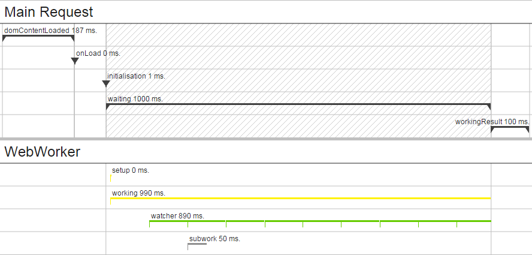

# HRDNS StopWatchJS
StopWatchJS is a javascript clone from [Stopwatch Component](https://github.com/symfony/stopwatch).<br>
The Symfony "Stopwatch Component" is copyright by Fabien Potencier.<br>
Please read his [license](https://raw.githubusercontent.com/symfony/stopwatch/master/LICENSE).<br>
<br>
*The API is unstable and can change from commit to commit!*

## Installation
### Composer
[https://packagist.org/packages/sgc-fireball/stopwatchjs](https://packagist.org/packages/sgc-fireball/stopwatchjs)
```bash
composer require sgc-fireball/stopwatchjs
```

### Bower
[http://bower.io/search/?q=hrdns-stopwatchjs](http://bower.io/search/?q=hrdns-stopwatchjs)
```bash
bower install hrdns-stopwatchjs
```

## Usage
```javascript
define(['StopWatch/StopWatch'],function(StopWatch){
    StopWatch.start('loading','section');
    // do something
    var section = StopWatch.openSection('nameOfSection');
    // do something
    section.start('eventName','category');
    // do something
    section.stop('eventName');
    // do something
    StopWatch.closeSection('nameOfSection');
    // do something
    StopWatch.stop('loading');
});
```

## Example

- [Old school](examples/old_school.html)
- [RequireJS](examples/requirejs.html)
- [WebWorker](examples/worker.html)

## Copyright and License
Richard Hülsberg - [rh+github@hrdns.de](mailto:rh+github@hrdns.de) - <https://www.hrdns.de>
You can read the license [here](LICENSE.md)

## Greets and Thanks
- [phpjs.org](http://phpjs.org/)
- [Fabien Potencier](https://github.com/symfony/stopwatch)
